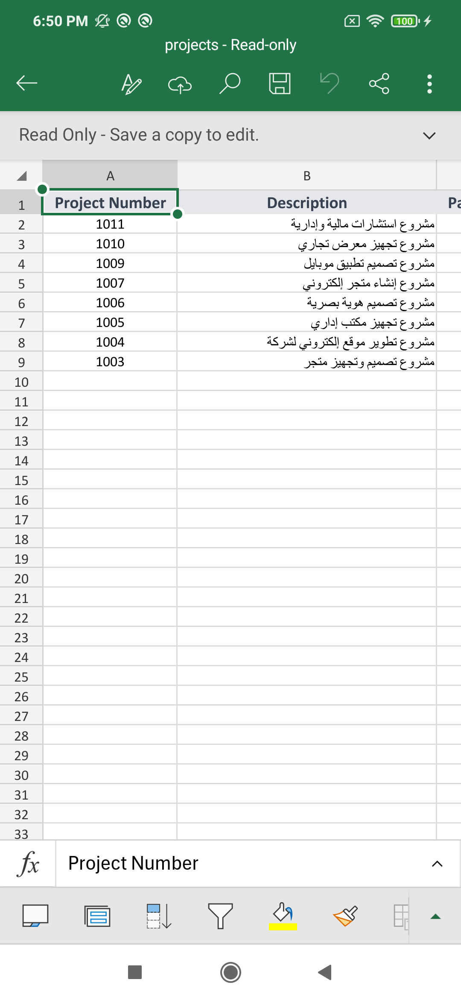

# Hisab — Financial Project Management App

Hisab is a Flutter application designed to help users manage financial projects and track their financial details in one place.

The app provides project management, financial summaries, Arabic and English localization, and Excel export functionality.

## Screenshots

| Projects Screen | Project Details | Excel Export |
|---|---|---|
|  |  |  |

## Features

- **Project Management:** Create, edit, delete, and search projects.
- **Financial Tracking:** Record paid amounts, received amounts, and wallet amounts.
- **Automatic Calculations:** Calculate each project's net balance and remaining cash on hand.
- **Financial Summaries:** Display total net balance, total paid amounts, and total received amounts across all projects.
- **Pagination:** Browse projects through paginated lists.
- **Localization:** Support for Arabic and English, including RTL and LTR layouts.
- **Authentication:** User authentication and profile management.
- **Excel Export:** Export project data to structured `.xlsx` files.

## Tech Stack

- **Framework:** Flutter
- **Language:** Dart
- **Architecture:** Clean Architecture
- **State Management:** Cubit (`flutter_bloc`)
- **API Integration:** Dio
- **Secure Storage:** `flutter_secure_storage`
- **Localization:** `easy_localization`
- **Excel Generation:** Syncfusion Flutter XlsIO

## Architecture

The application follows Clean Architecture principles to separate presentation, domain, and data responsibilities. This keeps the code organized and makes individual features easier to maintain and extend.

## Getting Started

### Prerequisites

- Flutter SDK
- Access to a running Hisab backend API

### Installation

1. Clone the repository:

```bash
   git clone https://github.com/rahafaltaweel2005/hisab.git
   cd hisab
```

2. Install dependencies:

```bash
   flutter pub get
```

3. Set the API base URL in the project's configuration to point to your Hisab backend instance.

4. Run the application:

```bash
   flutter run
```

**Note:** The backend API is maintained separately and is not included in this repository. Features that depend on the API (authentication and project management) require a reachable backend instance.

## Excel Export

Hisab uses Syncfusion Flutter XlsIO to generate Excel workbooks from project data. The export organizes project information into spreadsheet columns and applies formatting to improve readability, including column sizing.

## Author

**Rahaf Taweel**

- GitHub: [rahafaltaweel2005](https://github.com/rahafaltaweel2005)

## Feedback

Feedback and suggestions are welcome.
